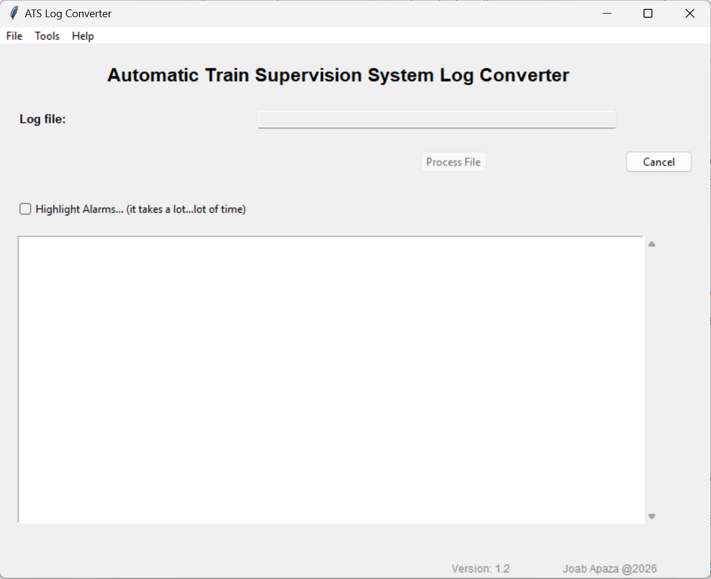

# ATS_EXCEL_-public-
Personal proyect developed to improve the analysis of ATS logs.
# 🚆 Railway Signalling Management System for Automatic Train Supervision (ATS) logs

Sistema desarrollado para la gestión, monitoreo y análisis de equipos de registros de Programa de Supervisión ferroviaria.

> ⚠️ Este repositorio contiene únicamente material demostrativo.
> El código fuente se mantiene en un repositorio privado por motivos de Seguridad.

---

## 📋 Resumen

El programa permite

- Parse from .attrib.data to Excel
- Decode messages ATS-PSIS, y ATS-SCADA contained in thje logs.
- Timetable visualization

---

## 🖼 Screenshots

### Initial Screen

---

### Processing

./images/ATS_to_Excel_2.png

---

### Tools included

./images/ATS_to_Excel_3.png

---

### Decode window

./images/ATS_to_Excel_4.png

---

## 🚀 Evolución del Proyecto

### Octubre 2025
- Inicio, conversión simple de log a excel

### Noviembre 2025
- Menú de herramientas, busqueda de logs mejorada, procesamiento, consola de vista

### Enero 2026
- Se añade decodificación de mensjaes PSIS

### Marzo 2026
- Se añade decodificación SCADA

### Junio 2026
- Malla horaria en toools. ligera mejora de velocidad de procesamiento

### Septiembre 2026
- Refinamiento de interfaz.

---

## 📈 Estado del Proyecto

✅ En uso y desarrollo activo para fines personales

## 👨‍💻 Autor

**Joab Apaza**

Signalling Systems Maintenance Engineer

Lima, Perú

---

